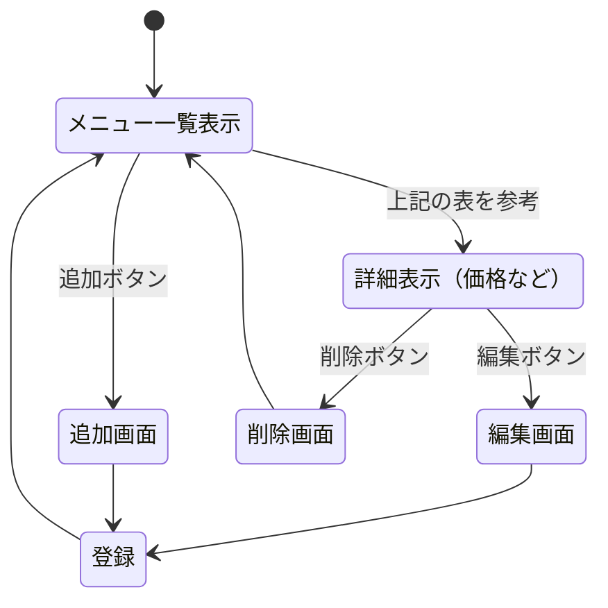
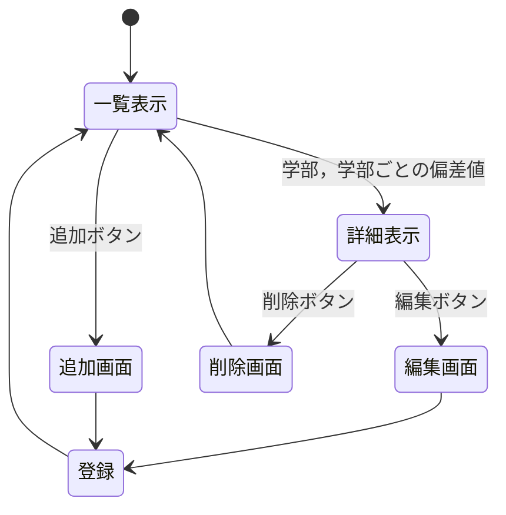

# 開発者用仕様書（仮）

## 1.吉野家メニュー
自分のバイト先が潰れるので記念に.
バイト先（ミーナ津田沼店）にあるものだけにします．
### 表

名前（メニュー）| id | 分岐点 | 備考
-|-|-|-
牛丼|beef|トッピング|
吉野家の丼|bowl|トッピング，種類|豚丼，牛カルビ丼，から揚げ丼
から揚げ|chicken|トッピング|から揚げが入ってるもの全部
定食|set|種類|期間限定・テイクアウト限定も含む
おかず（皿メニュー）|okazu|種類|-
期間限定|limited|種類|作成時は冬期間
カレー|curry|トッピング，種類|カレーとハヤシ
鰻|eel|種類|-
朝食|breakfast|種類|-
お子様セット|kids|種類|カレーと牛丼の２種類
サイドメニュー・お飲み物|side|種類|-

### 図

追加・削除機能は期間限定が変わった時に活用する．

## ２．山形の大学一覧
出身が山形なので．全部で11種類ほど．
### 表

名前| id | 分岐点 | 備考
-|-|-|-
大学（国公立）|public|種類，学部|学部ごとの偏差値を表示
大学（私立）|private|種類，学部|学部ごとの偏差値を表示
短期大学|short|種類，学部|学部ごとの偏差値を表示

### 図

追加・削除機能は偏差値が変わった時や新たにできた時などに活用する．

## 津田沼駅周辺のラーメン屋

### 表

名前| id | 分岐点 | 備考
-|-|-|-
麺場 田所商店|tadokoro|種類（味噌）|北海道／信州／九州味噌など
必勝軒|hisshoken|種類|つけ麺・ラーメン
栄昇らーめん 匠|eisho|種類|魚介・塩・醤油
超ごってり麺 ごっつ|gottsu|種類（こってり）|濃厚背脂
日高屋（津田沼）|hidakaya|種類（チェーン）|定番・価格低め
壱角家（津田沼）|ikkakuya|種類（家系）|ライス無料のことが多い
なりたけ（津田沼）|naritake|種類（こってり）|背脂多め

### 図

追加・削除機能は閉店・新規オープン・メニュー変更時に活用する．

