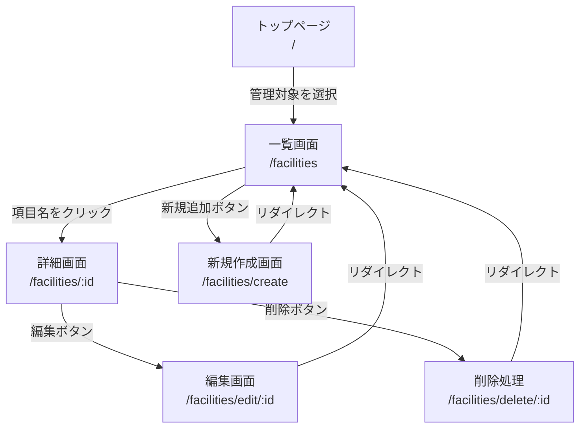

```mermaid
flowchart TD
    Top["トップページ<br/>/"]

    List["一覧画面<br/>/facilities"]
    Detail["詳細画面<br/>/facilities/:id"]

    Create["新規作成画面<br/>/facilities/create"]
    Edit["編集画面<br/>/facilities/edit/:id"]
    Delete["削除処理<br/>/facilities/delete/:id"]

    Top -->|管理対象を選択| List

    List -->|項目名をクリック| Detail
    List -->|新規追加ボタン| Create

    Create -->|リダイレクト| List

    Detail -->|編集ボタン| Edit
    Detail -->|削除ボタン| Delete

    Edit -->|リダイレクト| List
    Delete -->|リダイレクト| List
```
